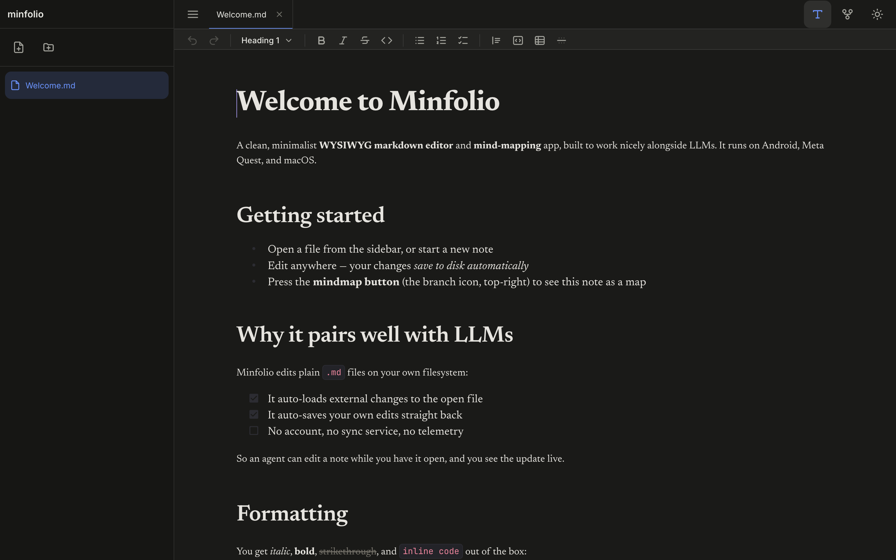
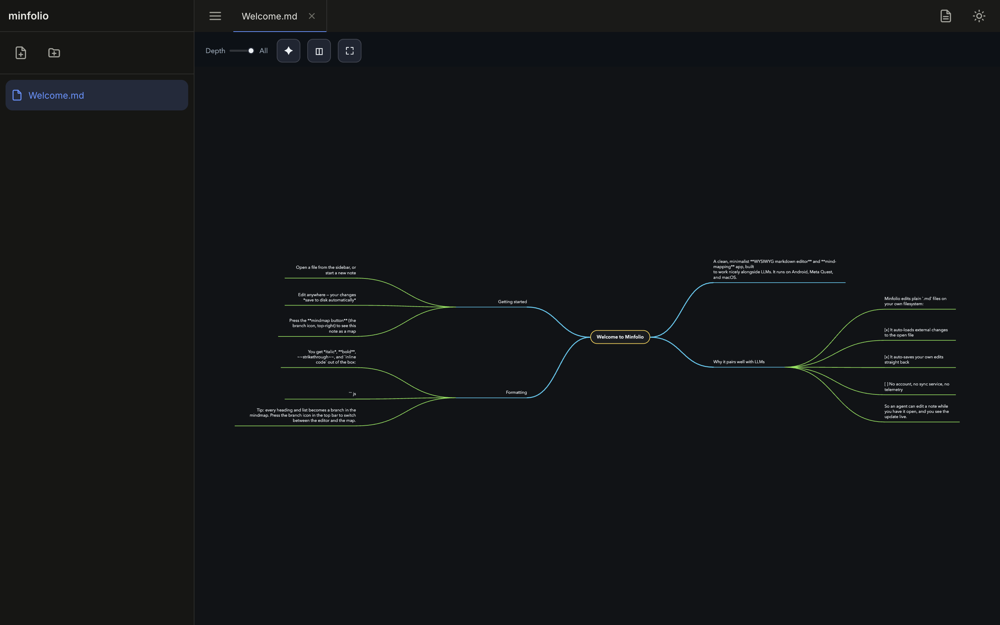
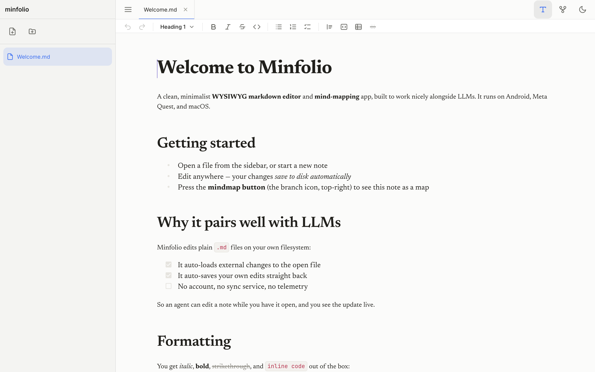

# Minfolio

A clean, minimalist **WYSIWYG markdown editor and mind-mapping app**, designed to
work well alongside LLMs.

Minfolio edits plain `.md` files on your own filesystem. It **automatically loads
external changes** to the file you have open and **automatically saves your
edits** back to that same file. Because the file on disk is the single source of
truth, an LLM or agent can edit a note while you have it open and you see the
update live, and anything you write is saved back for the LLM to read.

If you and the agent change the same note at the same time, Minfolio
**automatically merges the non-conflicting edits** for you: it runs a three-way,
line-level merge (the same approach git uses) against the last-synced version, so
edits that touch different lines just fold together silently and save. It only
stops to ask you when both sides changed the *same* lines, which is a real
conflict. There is no account, no sync service, and no telemetry.

The same codebase runs as a macOS desktop app and as an Android app (including on
Meta Quest), and supports multiple windows on both.

## Screenshots

The editor, with the inline WYSIWYG rendering and the formatting bar (undo/redo,
headings, lists, code, tables):



The same note as a mindmap. Every heading and list item becomes a branch, and
edits flow back to the markdown:



Light theme:



## Features

- **Inline WYSIWYG markdown.** Built on [Milkdown](https://milkdown.dev/) (Crepe
  + ProseMirror). Formatting renders in place; the raw markdown markers appear
  around the block you are editing.
- **Mindmap view.** Every note can be viewed as a mindmap, giving you a more
  visual, spatial way to navigate and edit the structure of your markdown
  document. It is a live mindmap view of the same file: edits in the mindmap
  flow back into the markdown, and vice versa. Drag a node onto another's
  top/bottom edge to re-sequence it, or onto its centre to nest it. Pan and zoom
  with mouse, trackpad, or touch (including pinch-to-zoom on touch devices and
  Quest).
- **LLM-friendly file sync.** Auto-loads external edits to the open file and
  auto-saves your own edits back to it, so Minfolio and an LLM agent can share
  the same file in real time.
- **Automatic merge of concurrent edits.** When the open file changes on disk
  while you have unsaved edits, Minfolio performs a three-way, line-level merge
  (diff3-style) against the last-synced version. Non-conflicting changes (edits
  on different lines) merge and save automatically; only edits to the same lines
  prompt you to choose. A toggle in the formatting bar switches between this
  auto-merge mode and a plain reload-with-prompt mode.
- **Formatting toolbar** with multi-level undo/redo, headings, bold/italic/
  strikethrough/inline code, highlight, bullet/numbered/task lists, quotes, code
  blocks, tables, and dividers.
- **Highlight.** Wrap text in `==marks==` (or use the toolbar) to highlight it;
  round-trips cleanly to and from the markdown.
- **Comments.** Attach a note to a block from the toolbar. Comments are stored
  inline in the `.md` file as a plain, readable HTML comment
  (`<!-- folio-comment: ... -->`) — invisible when the markdown is rendered
  elsewhere, but readable in the raw file, so an LLM agent can read or write them
  too.
- **Workspace folders (desktop).** Add any folder on disk to the sidebar, each
  with its own accent colour and recently-opened files. Folders and recents are
  shared and kept in sync live across windows. Files outside the Documents
  workspace open and save by absolute path; right-click a tab to reveal the file
  in Finder.
- **Multiple windows** on Android (and on macOS), each kept in sync with the
  others as files change on disk. On macOS, each window's position and size are
  restored on relaunch.
- **Day and night themes**, applied live without reloading the document.
- **Self-hosted fonts** (Inter, Newsreader, JetBrains Mono): no network calls.

## Platform support

| Platform        | Toolchain | Notes                                          |
| --------------- | --------- | ---------------------------------------------- |
| macOS           | Electron  | Native menus, multi-window, file open          |
| Android / Quest | Capacitor | Android 8+; multi-window; pinch-zoom mindmap   |
| Web             | Vite      | Any modern browser (also the dev environment)  |

## Getting started

Prerequisites: [Node.js](https://nodejs.org/) 18+ and npm.

```bash
npm install        # install dependencies
npm run dev        # start the web app (Vite dev server)
```

### Build

```bash
npm run build      # type-check (tsc --noEmit) and build to dist/
```

### Android (and Meta Quest)

```bash
npm run android    # build the web assets and sync into the Capacitor project
```

Then open `android/` in Android Studio to run or build an APK. You will need an
Android SDK installed; create your own `android/local.properties` pointing at it
(this file is intentionally gitignored). Quest devices install the same APK.

### macOS desktop (Electron)

```bash
npm run electron:dev      # run the desktop app against the Vite dev server
npm run electron:build    # build a distributable .dmg into release/
```

## Project structure

```
src/
  editor/      Milkdown Crepe wrapper, highlight + comment plugins
  fs/          filesystem abstraction, external-change watcher, workspace folders
  ui/          shell, tabs, sidebar(s), formatting bar, mindmap host, tooltips, dialogs
  styles/      theme + dialog CSS
  store.ts     app state
  main.ts      app wiring (autosave, external-change reload, multi-window)
public/mindmap/  the embedded mindmap engine (loaded in an iframe)
electron/      Electron main + preload
android/       Capacitor Android native project
```

## License

Minfolio is released under the [MIT License](LICENSE).

It bundles third-party software (Milkdown, Capacitor, Electron, ProseMirror, and
the Inter / Newsreader / JetBrains Mono fonts). Their licenses and attributions
are listed in [THIRD-PARTY-LICENSES.md](THIRD-PARTY-LICENSES.md). The fonts are
licensed under the SIL Open Font License 1.1.
